### Einkaufsliste
#### Brisket
- [ ] brisket fleisch: ca 3kg
- [ ] brisket gewürzmischung: 1 Dose
- [ ] rauch holz
- [ ] alufolie
- [ ] alu pfanne
- [ ] Bier (flüssigkeit)

#### Kartoffelsalat
- [ ] Kartoffeln festkochend
- [ ] wasser
- [ ] boullion würfel
- [ ] Mayonaise
- [ ] Senf
- [ ] Zwiebeln gehackt
- [ ] weisswein Essig
- [ ] Joghurt nature
- [ ] öl
- [ ] Schnittlauch

#### Tiramisu
- [ ] 12 Eier
- [ ] 500g Zucker
- [ ] 1kg Mascarpone
- [ ] 60 Löffelbiskuit
- [ ] 1L Kaffee
- [ ] Kakao pulver

### Grill vorbereiten
- kohle auf beiden seiten, wasserpfanne in der mitte
- ode kohle auf einer seite, wasserpfanne auf der anderen seite
- holz chunks für rauchgeschmack, ca nach 45min nachlegen
- top vent open
- bottom vent open
- 120c-130c grill temp
- ca 3-4 briquets kohle nachlegen, wenn temp unter 110° sinkt

### Zubereitung
- (https://www.youtube.com/watch?v=Y6YMdmJRerU)
- brisket mit gewürzmischung einreiben. in alle nooks und crannies.
- - evt mit french mustard einreiben, damit die gewürzmischung besser hält.
- brisket ca 45 minuten ruhen lassen.
- nach ca 4h (kerntemp 72-75) in alu folie & alu pfanne einpacken, weiter auf den grill
- nach ca 2h (kerntemp ca 95) auspacken
- ca 30-45min ruhen lassen
- schneiden in ca 1hb bleistift dicke scheiben

### Beilagen
- +kohlenhydrat: kartoffelsalat (https://www.swissmilk.ch/de/rezepte-kochideen/rezepte/LM_div_1013_01/kartoffelsalat/)
- +zucker/fett/kohlenhydrat: tiramisu (https://www.lebeccherie.it/allegati/ricetta-storia-tiramisu-en.pdf)
- pilz gyoza
- - wrapper 35 min (https://www.happyfoodstube.com/gyoza-wrappers/#recipe)
- sauce
- - 

```mermaid
gantt
    title Brisket
    dateFormat HH:mm
    axisFormat %H:%M
    tickInterval 30minute

    section Einkauf
    Einkaufen :active, einkaufen, 09:00, 1h
    
    section Essen
    Vorspeise :active, vorspeise, 18:00, 30m
    Hauptspeise :active, hauptspeise, after vorspeise, 1h
    Dessert :active, dessert, after hauptspeise, 30m

    section Brisket
    Grill einheizen :active, grillheizen, after einkaufen, 15m
    Brisket würzen :active, briskwuerzen, after grillheizen, 15m
    Reorganisieren :active, briskreorg, after briskwuerzen, 15m
    Brisket braten :briskbraten, after briskwuerzen, 4h
    Brisket in alu verpacken :milestone, after briskbraten, 0m
    brisket in alu braten :briskalu, after briskbraten, 2h
    brisket von grill nehmen :milestone, after briskalu, 0m
    brisket ruhen :briskruhen, after briskalu, 45m

    section Kartoffelsalat
    Kartoffel salat :active, kartoffelsalat, after tirreorg, 30m
    Reorganisieren :active, karreorg, after kartoffelsalat, 15m
    Kartoffel salat ruhen :karruhen, after kartoffelsalat, until hauptspeise

    section Tiramisu
    Kaffe machen :active, tirkaffe, after briskreorg, 15m
    Tiramisu bauen :active, tirbauen, after tirkaffe, 30m
    Reorganisieren :active, tirreorg, after tirbauen, 15m
    Tiramisu ruhen :tirruhen, after tirbauen, until dessert
    
    section Gyoza
    Wrapper machen :active, gyowrapper, 16:30, 35m
    Gyoza bauen :active, gyobauen, after gyowrapper, 45m
    Reorganisieren :active, gyoreorg, after gyobauen, 15m
```

