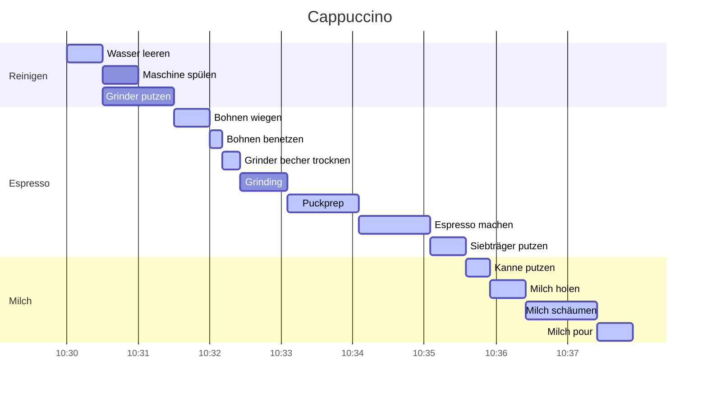
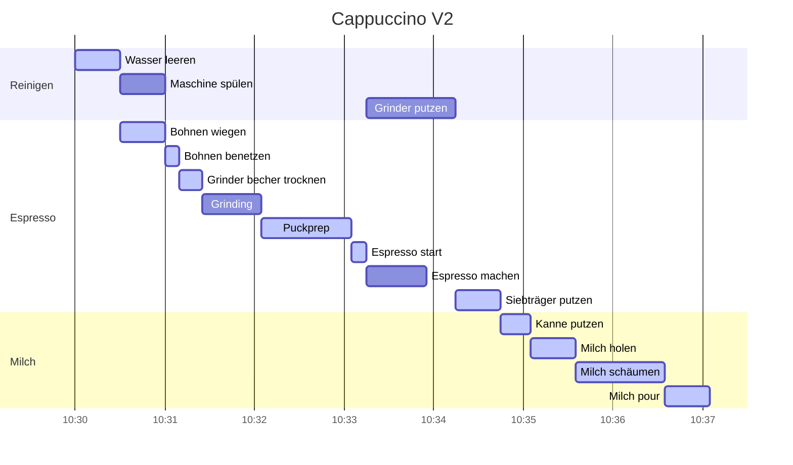
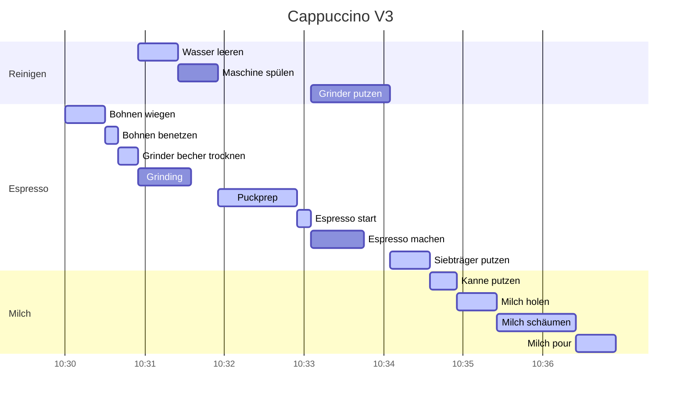

```mermaid
gantt
    title Cappuccino
    dateFormat HH:mm
    axisFormat %H:%M
    tickInterval 1minute

    section Reinigen
    Wasser leeren :active, wasserleer, 10:30, 30s 
    Maschine spülen :spulen, after wasserleer, 30s
    Grinder putzen :grinderputz, after wasserleer, 1m 

    section Espresso
    Bohnen wiegen :active, bohnwieg, after grinderputz, 30s
    Bohnen benetzen :active, bohnnetz, after bohnwieg, 10s
    Grinder becher trocknen :active, grindbechtrock, after bohnnetz, 15s
    Grinding :grinding, after grindbechtrock, 40s

    Puckprep :active, puckprep, after grinding, 1m
    Espresso machen :active, espresso, after puckprep, 1m
    Siebträger putzen :active, siebputz, after espresso, 30s

    section Milch
    Kanne putzen :active, kanneputz, after siebputz, 20s
    Milch holen :active, holmilch, after kanneputz, 30s
    Milch schäumen :active, milchschaum, after holmilch, 60s
    Milch pour :active, milchschenk, after milchschaum, 30s
```

```mermaid
gantt
    title Cappuccino V2
    dateFormat HH:mm
    axisFormat %H:%M
    tickInterval 1minute

    section Reinigen
    Wasser leeren :active, wasserleer, 10:30, 30s 
    Maschine spülen :spulen, after wasserleer, 30s

    Grinder putzen :grinderputz, after espressostart, 1m

    section Espresso
    Bohnen wiegen :active, bohnwieg, after wasserleer, 30s
    Bohnen benetzen :active, bohnnetz, after bohnwieg, 10s
    Grinder becher trocknen :active, grindbechtrock, after bohnnetz, 15s
    Grinding :grinding, after grindbechtrock, 40s

    Puckprep :active, puckprep, after grinding, 1m
    Espresso start :active, espressostart, after puckprep, 10s
    Espresso machen :espresso, after espressostart, 40s
    Siebträger putzen :active, siebputz, after grinderputz, 30s

    section Milch
    Kanne putzen :active, kanneputz, after siebputz, 20s
    Milch holen :active, holmilch, after kanneputz, 30s
    Milch schäumen :active, milchschaum, after holmilch, 60s
    Milch pour :active, milchschenk, after milchschaum, 30s
```

```mermaid
gantt
    title Cappuccino V3
    dateFormat HH:mm
    axisFormat %H:%M
    tickInterval 1minute

    section Reinigen
    Wasser leeren :active, wasserleer, after grindbechtrock, 30s 
    Maschine spülen :spulen, after wasserleer, 30s

    Grinder putzen :grinderputz, after espressostart, 1m

    section Espresso
    Bohnen wiegen :active, bohnwieg, 10:30, 30s
    Bohnen benetzen :active, bohnnetz, after bohnwieg, 10s
    Grinder becher trocknen :active, grindbechtrock, after bohnnetz, 15s
    Grinding :grinding, after grindbechtrock, 40s

    Puckprep :active, puckprep, after spulen, 1m
    Espresso start :active, espressostart, after puckprep, 10s
    Espresso machen :espresso, after espressostart, 40s
    Siebträger putzen :active, siebputz, after grinderputz, 30s

    section Milch
    Kanne putzen :active, kanneputz, after siebputz, 20s
    Milch holen :active, holmilch, after kanneputz, 30s
    Milch schäumen :active, milchschaum, after holmilch, 60s
    Milch pour :active, milchschenk, after milchschaum, 30s
```
